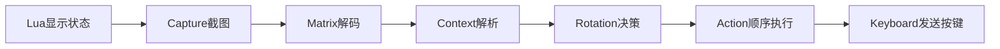

<p align="center">
  
</p>

<h1 align="center">PixBeastMastery</h1>
<p align="center"><strong>猎群领袖兽王猎 · 像素读取 · 自动循环</strong></p>

Lua 在游戏内显示状态，Python 读取像素并按优先级发送技能键位。面向 Windows、正式服简体中文客户端，只维护猎群领袖兽王猎的一套循环。

## 快速开始

需要 Python 3.13 和 uv。在项目目录运行：

```powershell
uv sync --python 3.13
uv run python -m pix.main
```

1. 启动游戏，等待桌面程序识别 `wow.exe`。
2. 点击 **拷贝插件**，将 `pix/lua/` 的全部内容复制到游戏目录的 `Interface/AddOns/PixBeastMastery/`。
3. 在游戏内执行 `/reload`，确认插件已启用。
4. 桌面端点击 **启动截图**，确认定位成功后点击 **启动循环**。

也可手动复制插件。`PixBeastMastery.toc` 必须直接位于 `AddOns/PixBeastMastery/` 下，保留子目录、字体和纹理。拷贝按钮会覆盖同名文件，并保留目标目录中的额外文件。

TOC 声明 Interface `120100`、版本 `12.1.0.68209`，这是仓库目标版本，不代表其他客户端已验证。插件检查猎人兽王专精；英雄天赋由玩家自行选择猎群领袖。切换专精后会提示重载，不匹配时禁用自身，不会自动启用其他插件。

插件加载时绑定下表组合键，并设置 UI 缩放、抗锯齿、亮度、对比度及部分镜头 CVar，详见 [base.lua](pix/lua/core/base.lua)。像素区域需要可见且不被遮挡。

## 游戏内控制

配置保存在独立的 `PixBeastMasteryDB`，不读取其他职业插件的配置。

| 设置 | 默认值 | 行为 |
| --- | --- | --- |
| 攻击模式 | 自动 | 自动按敌人数选择；也可强制单体或AOE |
| 收尾状态 | 自动 | 自动：非遭遇战且目标血量严格低于阈值时收尾；关闭：不收尾；开启：强制收尾，包括遭遇战中。收尾仅禁用狂野怒火 |
| 收尾血量阈值（%） | 20 | 可设0–50，步进5；仅影响自动模式，0表示自动不收尾；脱战及重载保留 |
| 集中值上限 | 100 | 可设100–120整数；应与角色实际上限一致，用于还原集中值点数 |
| 自动饰品 | 开启 | 爆发窗口内且目标在攻击范围时使用13、14槽饰品 |
| 爆发药水 | 开启 | 相同条件下使用普通鲁莽药水241288、241289，按此顺序尝试 |
| 打断黑名单 | 内置默认列表 | 可编辑法术ID；升序取前15项，按施法图标匹配 |

两个状态按钮均为100×24原生 UI 单位，不参与像素采样区的分辨率换算，左侧图标、右侧文字。攻击模式自动为绿、单体为蓝、AOE为橙；收尾自动为绿、关闭为灰、开启为红，左击按自动→关闭→开启→自动循环。Shift+左键拖动，位置保存。收尾按钮吸附攻击模式按钮下方；攻击模式按钮不存在时才独立拖动。

每次脱离战斗或重载，攻击模式与收尾模式均恢复自动。收尾血量阈值、其他配置和按钮位置保留。

| 命令 | 作用 |
| --- | --- |
| `/pix` | 显示帮助 |
| `/pix toggle` | 切换插件启停 |
| `/pix disable` | 关闭插件 |
| `/pix auto` | 自动攻击模式 |
| `/pix single` | 强制单体 |
| `/pix aoe` | 强制AOE |
| `/pix end auto`、`/pix end off`、`/pix end on`、`/pix end toggle` | 自动、关闭、开启收尾；toggle按自动→关闭→开启→自动循环 |
| `/pix burst` | 开启15秒爆发窗口 |
| `/pix burst 30`、`/pix burst 0` | 开启30秒窗口、结束窗口 |
| `/pix delay 0.4` | 暂停所有自动动作0.4秒；省略参数同样为0.4秒 |

插件加载时默认启用，并开启60秒爆发窗口。爆发只控制饰品和鲁莽药水，狂野怒火按输出规则与收尾状态判断。

## 循环行为

每次只执行第一个满足条件的动作。启停、手动延迟、死亡、坐骑/载具、聊天、地面选点和施法/引导/蓄力会暂停自动动作。

1. **恢复宠物**：缺宠或死宠时，移动则等待站定，站定后执行召唤/复活宏；位于战斗和目标判断之前。
2. **自动误导**：只在非团队小队、脱战时执行。要求学会误导、冷却好，有存活在线且在误导射程内的坦克。按party1–4取第一个合格坦克，不要求攻击目标，冷却好就可再次释放。
3. **战斗门控**：此后的打断、自保、输出和治疗宠物均要求玩家在战斗，且当前目标存在、存活、可攻击。
4. **反制射击**：焦点优先，目标其次；自身冷却好、单位在射程、可打断、图标不在黑名单、剩余施法或引导时间≤5秒。时间按0.1秒量化。
5. **自保**：生命≤30%先治疗石，再银月城生命药水241304；生命≤50%时意气风发。其他防御技能由玩家控制。
6. **爆发物品**：目标在反制射击范围时，依次鲁莽药水、上饰品、下饰品，受各自开关控制。
7. **输出**：按下面的优先级执行，所有进攻技能都参考反制射击147362射程。
8. **治疗宠物**：最低优先级；宠物存在、存活、生命<70%，且治疗宠物冷却好。脱战或没有有效当前目标时不执行。

敌人数只统计可观察姓名板中可攻击、存活、进入战斗且在147362射程内的单位，不代表所有附近敌人。自动模式人数≥2走AOE，0或1走单体；强制模式覆盖此判断。

| 顺序 | 输出条件 |
| --- | --- |
| 狂野怒火（AOE） | AOE、非收尾、冷却好，且玩家存在野兽顺劈268877；优先于倒刺和鞭笞 |
| 倒刺射击 | 技能可用，且下一层充能恢复<2秒；单体时狂野怒火冷却<3秒也满足 |
| 狂野鞭笞 | AOE、集中值≥35、冷却好 |
| 狂野怒火（单体） | 单体、非收尾、冷却好；不要求野兽顺劈 |
| 杀戮命令 | 可用、集中值≥30，且玩家增益471878/1276720/472324/472325任一存在 |
| 眼镜蛇射击 | 集中值≥35、有眼镜蛇利牙1299389，且单体或狂野鞭笞冷却>0 |
| 倒刺射击 | 技能可用 |
| 眼镜蛇射击 | 集中值≥35，且单体或狂野鞭笞冷却>0 |

核心 DPS 规则与经验来源见 [循环说明](docs/rotation-notes.md)。AOE 无野兽顺劈时不释放狂野怒火。

首领战等同于第86格的遭遇战状态，自动模式在遭遇战中始终不收尾。非遭遇战时使用现有目标预测生命比例，每轮判断是否严格低于配置阈值；恰好等于阈值不收尾，切换目标或血量恢复后重新判断。插件与Python须配套更新第60格三态协议及第87格阈值。集中值百分比由配置上限还原；配置错误会影响30/35点阈值判断。缺失冷却数据不视为就绪；满充能通过充能数量及上限识别。

## 键位

游戏插件创建安全按钮并绑定宏，不需要手工创建宏。改键位时同步修改 [macro.lua](pix/lua/macro.lua) 与 [rotation.py](pix/rotation.py)。

| 小键盘 | 右Ctrl | 右Shift |
| --- | --- | --- |
| 1 | 倒刺射击 | 误导party1 |
| 2 | 焦点反制射击 | 误导party2 |
| 3 | 目标反制射击 | 误导party3 |
| 4 | 狂野怒火 | 误导party4 |
| 5 | 狂野鞭笞 | 治疗石 |
| 6 | 杀戮命令 | 银月城生命药水 |
| 7 | 眼镜蛇射击 | 意气风发 |
| 8 | 鲁莽药水 | 上饰品 |
| 9 | 治疗宠物 | 下饰品 |
| 0 | 召唤/复活宠物 | — |

Ctrl+F12执行 `/reload`。召唤/复活宏为：

```text
/cast [@pet,dead] 复活宠物
/castsequence [nopet] reset=3 召唤宠物 1,复活宠物
```

## 桌面程序与开发

截图默认25 FPS，可选15–35；Action默认10 FPS，可选8–16，间隔有±50%随机浮动。桌面参数只保留到本次退出。停止截图会同时停止循环；再次启动截图后需要单独启动循环。



模块边界保持不变，像素协议见 [layout.md](layout.md)。4×4 Cell、12px高基板，插件与Python必须配套使用。截图失败或帧龄超过0.5秒时不发送对应动作。动作日志表示选中了动作，不代表游戏已确认施法成功。

```powershell
uv run pyright pix
uv run python -m compileall pix
uv run python -m pix.test_captura
```

最后一条只截图定位，不发送按键。没有自动化测试框架；客户端中的秘密值、冷却/充能、按钮拖动和实际施法需在游戏内验收。保持 `base.lua` 的 `debug = false`，调试倍率不适用于正式解码器。

本项目采用 [GNU General Public License v3.0](LICENSE)。主图由GPT生成，提示词见 [hero.prompt.md](docs/assets/hero.prompt.md)。
